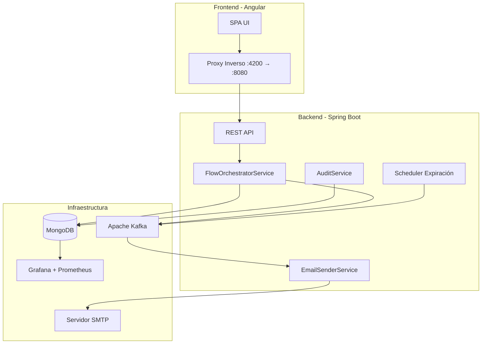
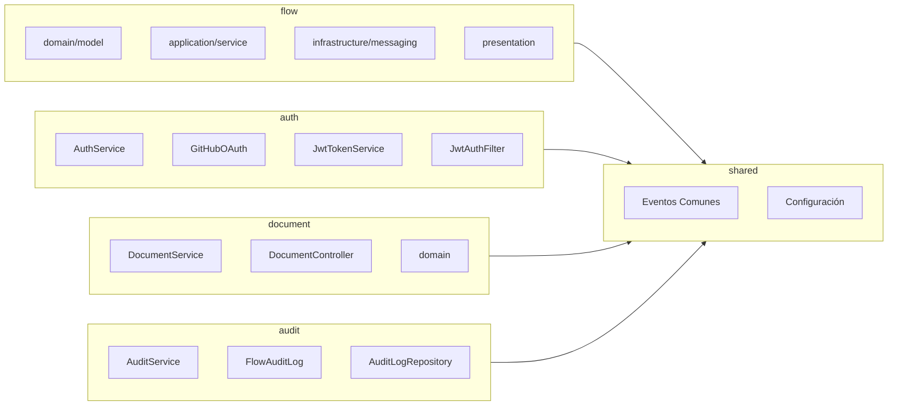
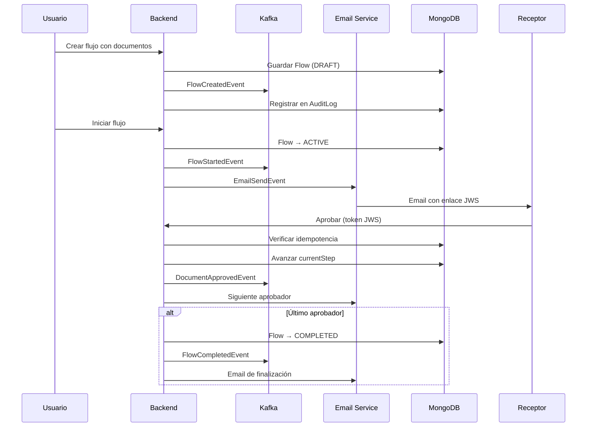
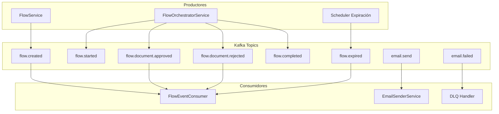
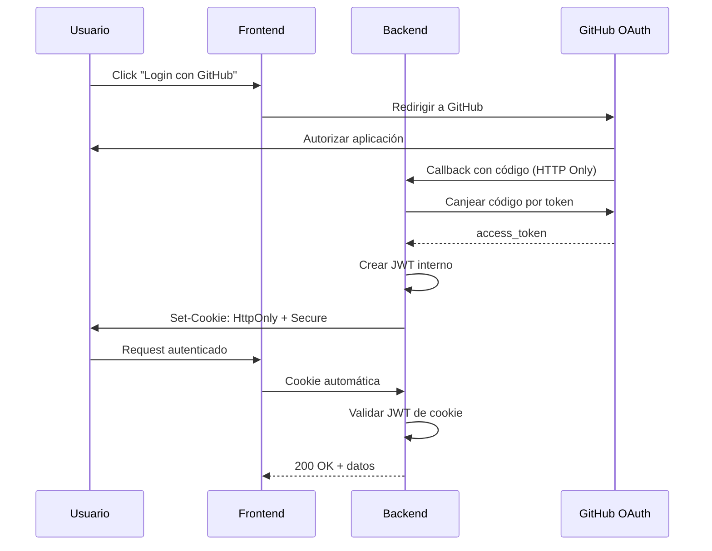
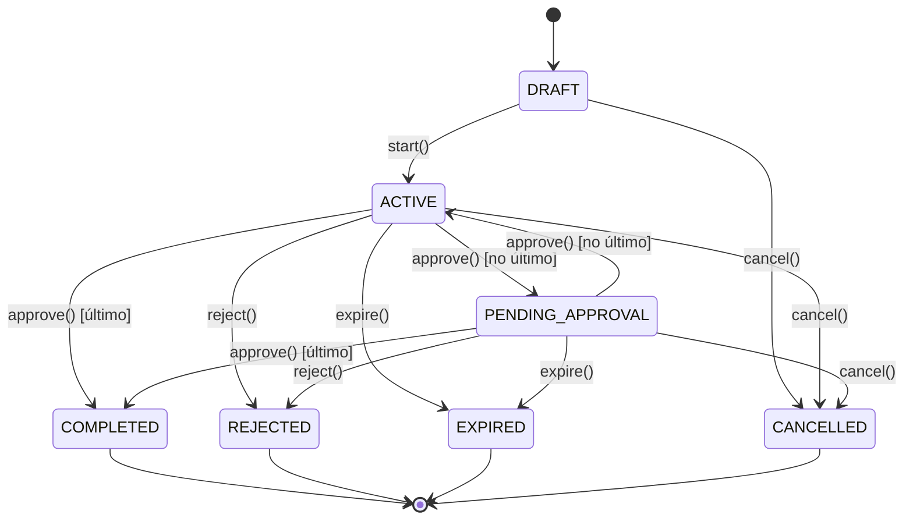
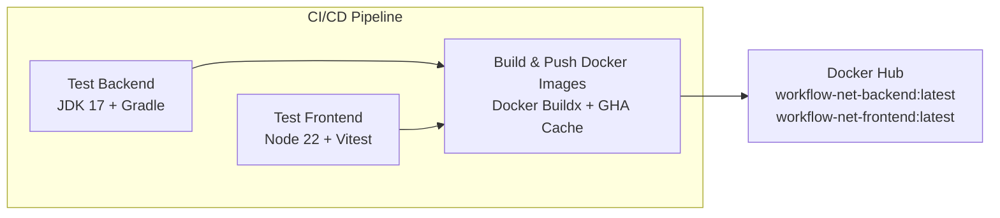

# WorkflowNet

Sistema de aprobación secuencial de documentos con **Arquitectura Orientada a Eventos** y **SAGA Orquestado**.

Construido con Spring Boot, Angular, MongoDB y Apache Kafka.

---

## Arquitectura General



---

## Stack Tecnológico

| Capa | Tecnología |
|---|---|
| **Backend** | Spring Boot v4.1, JDK 17 |
| **Frontend** | Angular v22, Tailwind CSS |
| **Base de Datos** | MongoDB v8.3 |
| **Mensajería** | Apache Kafka v4.3.0 |
| **Despliegue** | Docker, Docker Compose, Traefik |
| **Monitoreo** | Grafana, Prometheus |

### Compatibilidad de Node.js

Angular 22 requiere una de las siguientes versiones de Node.js:

| Node.js | Estado | Compatibilidad |
|---------|--------|----------------|
| **22.22.3+** | LTS | ✅ Soportado |
| **24.15.0+** | LTS | ✅ Soportado |
| **26.0.0+** | LTS | ✅ Soportado |
| 25.x | No LTS | ❌ No soportado |
| 21.x o inferior | EOL | ❌ No soportado |

> ⚠️ **Importante:** Node.js 25.x es una versión impar (no LTS) y **no es compatible** con Angular 22. Usa siempre versiones pares (22, 24, 26).

```bash
# Verificar versión actual
node --version

# Cambiar versión (si usas nvm-windows)
nvm use 22  # o 24, o 26

# Cambiar versión (si usas fnm)
fnm use 22  # o 24, o 26
```

### Gestores de Versiones de Node.js

| Gestor | Plataforma | Instalación |
|--------|------------|-------------|
| **nvm-windows** | Windows | https://github.com/coreybutler/nvm-windows/releases |
| **fnm** | Windows/Mac/Linux | `winget install Schniz.fnm` o https://github.com/Schniz/fnm |
| **nvm** | Mac/Linux | https://github.com/nvm-sh/nvm |

```bash
# nvm-windows: instalar desde .exe en GitHub Releases
# Después de instalar:
nvm install 26
nvm use 26

# fnm: más rápido que nvm
fnm install 26
fnm use 26
```

---

## Arquitectura Vertical Slices

Cada feature es una Slice independiente con su propio dominio, infraestructura y presentación:



---

## Flujo de Aprobación Secuencial (SAGA)



---

## Event-Driven Architecture



---

## Autenticación BFF (Backend-For-Frontend)



---

## Modelo de Dominio (Flow)



---

## Funcionalidad Principal

### Gestión Documental
- **Límite:** 5 documentos por flujo, 2MB máximo por documento
- Los documentos se guardan temporalmente en `./temp-documents` para adjuntar por correo
- Al finalizar, se elimina el archivo físico y solo se preserva el Hash SHA-256 + metadata

### Aprobación Secuencial
- El flujo viaja de participante en participante de manera ordenada
- Notificaciones automatizadas vía email al iniciar, avanzar, aprobar o rechazar

### Control de Expiración
- Scheduler diario (`@Scheduled`) revisa límites de gracia (+3 días)
- Emite `FlowExpiredEvent` a Kafka para cerrar flujos abandonados
- Índices TTL en MongoDB para limpieza autónoma de tokens expirados

### Resiliencia de Email
- Reintentos asíncronos (`@RetryableTopic`) con backoff exponencial
- **DLQ (Dead Letter Queue):** Correos fallidos van a `email-sending-dlq` para revisión

### Dashboard Maestro
- Panel KPI y métricas para administradores
- Tablas interactivas con paginación, filtros y ordenamientos sincronizados con la URL

---

## Seguridad

| Mecanismo | Descripción |
|---|---|
| **BFF Pattern** | Backend canjea código OAuth por JWT, frontend nunca maneja tokens |
| **HttpOnly Cookies** | Token en cookie `HttpOnly` + `Secure`, mitiga XSS |
| **JWS Tokens** | Tokens stateless en enlaces de correo para aprobación |
| **Idempotencia** | UUIDs únicos en MongoDB previenen procesamiento duplicado |
| **Audit Log** | Log inmutable (`flow_audit_log`) con hash SHA-256 |

---

## Desarrollo Local

### Requisitos

- Docker & Docker Compose
- JDK 17+
- **Node.js 22.x, 24.x o 26.x** (versiones LTS) — ver [compatibilidad](#compatibilidad-de-nodejs)
- GitHub OAuth App (Callback: `http://localhost:8080/api/auth/github/callback`)

### Inicio rápido

```bash
# 1. Clonar y configurar variables de entorno
cp .env.example .env
# Editar .env con valores reales

# 2. Configurar Git Hooks (una sola vez)
.\setup-hooks.bat

# 3. Iniciar todo (MongoDB, Kafka + Backend + Frontend)
.\start-dev.bat
```

El script levanta:
- **Docker:** MongoDB (:27017) + Kafka (:9092)
- **Backend:** Gradle en puerto 8080
- **Frontend:** Vite en puerto 4200 (proxy inverso → 8080)

### Detener todo

```bash
# Detener todos los procesos y contenedores
.\kill-dev.bat
```

El script detiene:
- Procesos Java (Backend / Gradle)
- Procesos Node.js (Frontend / Angular)
- Procesos en puertos 8080 y 4200 (conexiones huérfanas)
- Contenedores Docker (MongoDB + Kafka)

### Matar procesos por puerto (Windows)

Si necesitas liberar un puerto específico manualmente:

```bash
# Ver qué procesos están usando un puerto
netstat -ano | findstr :8080

# Matar el proceso por PID
taskkill /F /PID <PID>

# O buscar y matar todos los java
taskkill /F /IM java.exe
```

### Comandos Individuales

```bash
# Docker (MongoDB + Kafka)
docker compose -f src/docker/docker-compose.yml --env-file .env up -d mongodb kafka

# Backend
cd src/backend && ./gradlew bootRun

# Frontend (con proxy inverso hacia backend)
cd src/frontend && ng serve --proxy-config proxy.conf.json
```

### Proxy Inverso (Desarrollo)

El archivo `src/frontend/proxy.conf.json` redirige las peticiones `/api` del frontend al backend:

```json
{
  "/api": {
    "target": "http://127.0.0.1:8080",
    "secure": false
  }
}
```

| Puerto | Servicio | Descripción |
|--------|----------|-------------|
| 4200 | Frontend | Angular DevServer |
| 8080 | Backend | Spring Boot API |

Las llamadas a `http://localhost:4200/api/*` se proxean automáticamente a `http://localhost:8080/api/*`.

**Swagger UI (desarrollo):** `http://localhost:8080/swagger-ui.html`

**Swagger UI (producción):** `https://api.tu-dominio.com/swagger-ui.html`

### Variables de entorno (Desarrollo)

| Variable | Descripción | Requerida |
|----------|-------------|-----------|
| `MONGO_ROOT_USER` | Usuario root de MongoDB | Sí |
| `MONGO_ROOT_PASSWORD` | Contraseña root de MongoDB | Sí |
| `GITHUB_CLIENT_ID` | Client ID de GitHub OAuth | Sí |
| `GITHUB_CLIENT_SECRET` | Client Secret de GitHub OAuth | Sí |
| `GITHUB_REDIRECT_URI` | URI de callback (desarrollo: `http://localhost:8080/api/auth/github/callback`) | Sí |
| `JWT_SECRET` | Clave JWT (mínimo 64 caracteres) | Sí |
| `MAIL_HOST` | Servidor SMTP | Sí |
| `MAIL_USERNAME` | Usuario SMTP | Sí |
| `MAIL_PASSWORD` | Contraseña SMTP | Sí |

### Diagnóstico y Resolución de Problemas (Troubleshooting)

#### Error: `Command failed with error 13 (Unauthorized): 'Command find requires authentication'`
* **Causa:** Existencia de una clase `MongoConfig.java` que extiende de `AbstractMongoClientConfiguration` en `com.workflowspring.config` que anula la autoconfiguración nativa de Spring Boot e intenta conectarse sin credenciales a `localhost:27017`.
* **Solución:** Eliminar el archivo `MongoConfig.java`. Esto forzará a Spring Boot a usar su autoconfiguración nativa leyendo la propiedad `spring.data.mongodb.uri` de `application.yml`.

#### Error: `java.lang.IllegalArgumentException: state should be: databaseName does not contain ' '`
* **Causa:** Espacios en blanco al final de las variables de entorno en el script por lotes de Windows (`cmd.exe`), causados por espaciado incorrecto antes de los encadenadores `&&`. Ejemplo: `set VAR=VAL && set VAR2=VAL2` inyecta un espacio al final de `VAR`.
* **Solución:** Escapar las comillas de asignación y eliminar los espacios previos a `&&` en los scripts `.bat`:
  ```bat
  set "MONGO_DATABASE=%MONGO_DATABASE%"&& set "VAR=%VAR%"
  ```

#### Error: Cambios en credenciales del `.env` no se aplican en MongoDB
* **Causa:** Las credenciales root de MongoDB se configuran únicamente durante la creación inicial del volumen de datos del contenedor Docker.
* **Solución:** Recrear el contenedor limpiando los volúmenes de desarrollo antiguos:
  ```bash
  # Detener contenedores y limpiar volúmenes del compose
  docker compose -f src/docker/docker-compose.yml --env-file .env down -v
  
  # Limpieza general de volúmenes huérfanos locales si es necesario
  docker volume prune -f
  ```

#### Error: `Inlining of fonts failed` en build Docker del frontend
* **Causa:** Angular 22 descarga e inlinea Google Fonts automáticamente durante `npm run build` en producción. Los contenedores Docker no tienen acceso a internet durante el build, así que la descarga falla.
* **Solución:** Deshabilitar font inlining en `angular.json`:
  ```json
  "configurations": {
    "production": {
      "optimization": {
        "fonts": false
      }
    }
  }
  ```
* **Efecto:** Las fuentes no se inlinean en el CSS, pero siguen cargándose en runtime vía los `<link>` tags en `index.html` (sin cambio visual para el usuario).

---

## Git Hooks (Protección del Repositorio)

El proyecto incluye hooks Git para proteger el repositorio y mantener consistencia. Los hooks están en la carpeta `.githooks/` (rastreada por Git) y se ejecutan automáticamente.

### Instalación (requerido en cada PC)

**Después de clonar el repositorio**, ejecutar una sola vez:

```bash
# Windows
.\setup-hooks.bat

# Linux / Mac
chmod +x setup-hooks.sh && ./setup-hooks.sh
```

O manualmente:
```bash
git config core.hooksPath .githooks
```

### Hooks incluidos

| Hook | Archivo | Propósito |
|------|---------|-----------|
| **pre-commit** | `.githooks/pre-commit` | Bloquea commits directos en `main` o `master` |
| **commit-msg** | `.githooks/commit-msg` | Valida formato Conventional Commits |
| **pre-push** | `.githooks/pre-push` | Bloquea push a ramas protegidas y archivos sensibles |

### pre-commit — Bloqueo de rama principal

Impide hacer commits directamente en `main` o `master`. Siempre debes crear una rama de desarrollo.

```
=============================================
  HOOK PRE-COMMIT BLOQUEADO
  Archivo: .git/hooks/pre-commit
=============================================

No se permiten commits directos en 'main'.
Crea una rama de desarrollo y usa un Pull Request.

  git checkout -b feat/mi-nueva-funcionalidad
  # realizar cambios, agregar y commitear
  git push -u origin feat/mi-nueva-funcionalidad
  gh pr create
```

### commit-msg — Validación de Conventional Commits

Todos los mensajes de commit deben seguir el formato [Conventional Commits](https://www.conventionalcommits.org/):

```
<tipo>(<alcance>): <descripcion>
```

**Tipos permitidos:**

| Tipo | Uso |
|------|-----|
| `feat` | Nueva funcionalidad |
| `fix` | Corrección de bug |
| `docs` | Documentación |
| `style` | Formato (no afecta lógica) |
| `refactor` | Reestructuración sin cambio de comportamiento |
| `perf` | Mejora de rendimiento |
| `test` | Tests |
| `build` | Sistema de build o dependencias |
| `ci` | Configuración de CI/CD |
| `chore` | Tareas de mantenimiento |
| `revert` | Revertir un commit anterior |

**Ejemplos válidos (todos los tipos):**
```
feat(auth): agregar login con GitHub OAuth
fix(backend): corregir conexion a MongoDB
docs: actualizar README con guia de hooks
style(frontend): ajustar espaciado en componentes
refactor(flow): extraer logica de validacion
perf(query): optimizar consulta de auditoria
test(auth): agregar tests para JwtTokenService
build(backend): actualizar dependencias Gradle
ci(actions): agregar workflow de build
chore(scripts): actualizar start-dev.bat
revert: revertir cambio en FlowService
```

**Ejemplos inválidos:**
```
agregar login          ← falta tipo y parentesis
feat: algo             ← falta alcance (aceptable si es global)
FEAT(auth): msg        ← tipo en mayusculas
```

### pre-push — Protección de ramas y archivos sensibles

Antes de hacer `git push`, este hook:

1. **Bloquea push directo** a `main` o `master`
2. **Detecta archivos sensibles** en los commits a subir:
   - `.env`, `.env.local`, `.env.production`
   - Certificados: `*.pem`, `*.key`, `*.p12`, `*.pfx`, `*.jks`
   - Llaves SSH: `id_rsa*`

Si necesitas push un archivo sensible por alguna razón:
```bash
git push --no-verify
```

### Workflow obligatorio

```
1. git checkout -b feat/mi-funcionalidad
2. # desarrollar cambios
3. git add .
4. git commit -m "feat(scope): descripcion"   ← commit-msg valida formato
5. git push -u origin feat/mi-funcionalidad    ← pre-push valida rama
6. gh pr create
```

---

## Flujo de Trabajo

Este proyecto utiliza **SpecKit SDD** (Spec-Driven Development) y **TDD**:

- Nunca trabajar directo en `main` — usar ramas aisladas y Pull Requests
- Todos los cambios deben tener tests unitarios pasando
- Debate arquitectónico antes de código permanente
- Decisiones registradas en la bitácora de arquitectura

### Proceso para Crear un Pull Request (PR)

Para contribuir de forma manual y seguir la metodología del proyecto, sigue los siguientes pasos:

#### 1. Crear una Rama de Desarrollo
Nunca trabajes en la rama `main`. Crea una rama con nombre descriptivo y prefijo de tipo de cambio (ej. `fix/`, `feat/`, `chore/`, `docs/`):
```bash
git checkout -b <tipo-de-rama>/<nombre-descriptivo>
# Ejemplo: git checkout -b fix/mongo-auth-and-startup
```

#### 2. Confirmar los Cambios en Commits Atómicos
Agrupa tus cambios de forma lógica y realiza commits pequeños con mensajes claros:
```bash
# Registrar archivos para el commit
git add <archivo-modificado>

# Crear el commit
git commit -m "<tipo-de-commit>(<alcance>): <descripcion corta en minuscula>"
# Ejemplo: git commit -m "fix(backend): enable native mongo autoconfiguration with credentials"
```

#### 3. Subir la Rama al Repositorio Remoto
Envía tu rama local a GitHub:
```bash
git push origin <nombre-de-la-rama>
# Ejemplo: git push origin fix/mongo-auth-and-startup
```

#### 4. Crear el Pull Request usando GitHub CLI (`gh`)
Si usas `gh cli`, puedes gestionar todo el flujo desde la terminal:

* **Iniciar sesión (si no estás autenticado):**
  ```bash
  gh auth login
  ```
* **Crear el Pull Request de forma no interactiva (pasando título y cuerpo):**
  ```bash
  gh pr create --title "<titulo-del-pr>" --body "<descripcion-del-cambio>"
  ```
* **Crear el Pull Request de forma interactiva (asistida en consola):**
  ```bash
  gh pr create
  ```
* **Revisar Pull Requests abiertos en el repositorio:**
  ```bash
  gh pr list
  ```
* **Ver el estado de tus Pull Requests actuales:**
  ```bash
  gh pr status
  ```

#### 5. Integrar (Merge) el Pull Request
Una vez revisado y validado el PR, se debe integrar a la rama principal `main`. Puedes hacerlo de dos formas:

##### A. Desde la Terminal con GitHub CLI (`gh`)
* **Hacer merge interactivo (te preguntará el tipo de merge y si deseas borrar la rama local y remota):**
  ```bash
  gh pr merge
  ```
* **Hacer merge directo (estilo Squash, que consolida todos los commits y limpia la rama):**
  ```bash
  gh pr merge --squash --delete-branch
  ```
* **Hacer merge tradicional (crea un commit de fusión):**
  ```bash
  gh pr merge --merge --delete-branch
  ```

##### B. Desde la Interfaz Web de GitHub
1. Ve a la pestaña **Pull Requests** en tu repositorio en GitHub.
2. Selecciona tu PR abierto.
3. Al final de la página de discusión, haz clic en **Merge pull request** (o elige *Squash and merge* en la flecha desplegable).
4. Haz clic en **Confirm merge**.
5. Presiona **Delete branch** para eliminar la rama de desarrollo ya integrada y mantener el repositorio limpio.

##### ¿Squash o Merge? Cuándo usar cada uno

**`--squash` (Recomendado por defecto)**

Consolida TODOS los commits del PR en un solo commit limpio en `main`:

```
# Historial en la rama feat/login:
a1b2c3d feat(auth): agregar login
d4e5f6g fix(auth): corregir validacion
h7i8j9k docs(auth): actualizar README

# Despues de squash merge, en main solo queda:
x1y2z3w feat(auth): agregar login con GitHub OAuth   ← 1 solo commit
```

**`--merge` (Tradicional)**

Crea un commit de fusion que une ambas ramas, conservando todos los commits originales:

```
# Historial en la rama feat/login:
a1b2c3d feat(auth): agregar login
d4e5f6g fix(auth): corregir validacion
h7i8j9k docs(auth): actualizar README

# Despues de merge tradicional, en main queda:
m1n2o3p Merge branch 'feat/login' into main   ← commit de fusion
  ├─ a1b2c3d feat(auth): agregar login
  ├─ d4e5f6g fix(auth): corregir validacion
  └─ h7i8j9k docs(auth): actualizar README
```

##### Cuándo usar cada opción

| Escenario | Recomendación |
|-----------|---------------|
| Feature normal | `--squash` |
| Hotfix rápido | `--squash` |
| Release branch | `--merge` |
| Rama con 1-2 commits significativos | `--merge` |
| Rama con muchos commits WIP/fix | `--squash` |
| Auditoría / compliance requerida | `--merge` |

> **Regla simple:** Usa `--squash` por defecto. Usa `--merge` solo cuando necesites preservar el historial completo de cambios.

##### ¿Qué es un WIP?

**WIP = Work In Progress** (Trabajo en Progreso). Son commits temporales que haces mientras desarrollas, como:

```
wip: intento de login
fix: arreglar algo
wip: probando otra cosa
fix: ahora si funciona
```

Estos commits **no son útiles en el historial de `main`** porque son ruido. Con `--squash` se consolidan en un solo commit limpio:

```
feat(auth): implementar login con GitHub OAuth   ← resultado final limpio
```

**Consejo:** Si haces muchos commits WIP, usa `--squash`. Si cada commit es significativo y limpio, puedes usar `--merge`.

---

## Referencia de Comandos `gh` (GitHub CLI)

Todos los comandos del flujo de desarrollo y CI/CD se ejecutan desde la terminal usando `gh` (GitHub CLI). Aquí tienes la referencia completa de cada comando, cuándo usarlo y ejemplos reales.

### Diagrama del Flujo Completo

```mermaid
graph TB
    subgraph Setup["1. Configuración Inicial"]
        A1[gh auth login] --> A2[git checkout -b rama/nombre]
    end

    subgraph Dev["2. Desarrollo"]
        A2 --> B1[git add .]
        B1 --> B2["git commit -m 'feat(scope): msg'"]
        B2 --> B3[git push -u origin rama/nombre]
    end

    subgraph PR["3. Pull Request"]
        B3 --> C1["gh pr create --title ... --body ..."]
        C1 --> C2[gh pr list]
        C2 --> C3[gh pr status]
        C3 --> C4["gh pr view <numero>"]
    end

    subgraph CI["4. CI/CD (Automático)"]
        C4 --> D1[gh run list]
        D1 --> D2["gh run watch <id> --exit-status"]
        D2 --> D3{Tests pass?}
        D3 -->|No| D4[gh run view <id> --log-failed]
        D3 -->|Sí| E1
    end

    subgraph Merge["5. Merge"]
        E1["gh pr merge <num> --squash --auto --delete-branch"] --> E2[gh pr merge (interactivo)]
        E2 --> F1[git checkout main]
        F1 --> F2[git pull]
    end

    subgraph Auth["6. Mantenimiento Auth"]
        G1["gh auth refresh -h github.com"] -.->|si expira| D2
    end

    style Setup fill:#e8f5e9
    style Dev fill:#e3f2fd
    style PR fill:#fff3e0
    style CI fill:#fce4ec
    style Merge fill:#f3e5f5
    style Auth fill:#fff9c4
```

### Comandos por Fase

#### Fase 1 — Configuración

| Comando | Descripción | Cuándo usarlo |
|---------|-------------|---------------|
| `gh auth login` | Iniciar sesión en GitHub CLI | Primera vez en cada PC, o si borras credenciales |
| `gh auth status` | Verificar si estás autenticado | Antes de cualquier comando `gh` que falle |
| `gh auth refresh -h github.com` | Renovar token expirado | Cuando `gh` devuelve error de autenticación |

```bash
# Primera autenticación
gh auth login

# Verificar estado
gh auth status

# Renovar si expiró (te pedirá abrir URL en navegador)
gh auth refresh -h github.com
```

#### Fase 2 — Desarrollo (git, no gh)

```bash
# Crear rama (NUNCA trabajar en main)
git checkout -b fix/mi-correccion

# Agregar y commitear
git add src/archivo-modificado.java
git commit -m "fix(backend): descripcion del cambio"

# Subir rama
git push -u origin fix/mi-correccion
```

#### Fase 3 — Pull Request

| Comando | Descripción | Cuándo usarlo |
|---------|-------------|---------------|
| `gh pr create` | Crear PR (interactivo) | Después de hacer push de tu rama |
| `gh pr create --title "..." --body "..."` | Crear PR directo (sin interactivo) | Para PRs rápidos o automatizados |
| `gh pr list` | Listar PRs abiertos | Ver qué PRs están pendientes de review |
| `gh pr status` | Ver estado de tus PRs | Ver si tu PR tiene conflictos o está listo para merge |
| `gh pr view <numero>` | Ver detalles de un PR | Revisar descripción, reviews, checks de un PR específico |

```bash
# Crear PR con título y descripción
gh pr create --title "fix: corregir error de autenticacion" --body "## What
Corrige el manejo de cookies HttpOnly en el filtro JWT.

## Why
Las cookies no se estaban enviando correctamente en requests cross-origin."

# Listar PRs abiertos
gh pr list

# Ver tus PRs y su estado
gh pr status

# Ver un PR específico
gh pr view 17
```

#### Fase 4 — Monitoreo de CI/CD

| Comando | Descripción | Cuándo usarlo |
|---------|-------------|---------------|
| `gh run list` | Listar ejecuciones recientes del workflow | Ver el historial de builds y su estado |
| `gh run watch <id> --exit-status` | Observar una ejecución en tiempo real | Después de push, para ver si el CI pasa |
| `gh run view <id> --log-failed` | Ver logs de los pasos que fallaron | Cuando un job del CI falla |
| `gh run view <id>` | Ver resumen de una ejecución | Ver qué jobs pasaron/fallaron sin entrar en logs |

```bash
# Ver últimas ejecuciones
gh run list

# Observar la ejecución más reciente (bloquea terminal hasta completar)
gh run watch --exit-status

# Observar una ejecución específica
gh run watch 27976213835 --exit-status

# Si falló, ver qué pasos fallaron
gh run view 27976213835 --log-failed

# Ver resumen rápido
gh run view 27976213835
```

#### Fase 5 — Merge

| Comando | Descripción | Cuándo usarlo |
|---------|-------------|---------------|
| `gh pr merge <numero> --squash --auto --delete-branch` | Merge squash + auto-merge + borrar rama | Flujo estándar (recomendado) |
| `gh pr merge <numero> --merge --delete-branch` | Merge tradicional + borrar rama | Cuando necesitas preservar commits individuales |
| `gh pr merge` | Merge interactivo | Cuando quieres elegir opciones en runtime |

```bash
# Merge squash estándar (el que usamos normalmente)
gh pr merge 17 --squash --auto --delete-branch

# Merge tradicional
gh pr merge 17 --merge --delete-branch

# Merge interactivo (te pregunta opciones)
gh pr merge 17
```

#### Fase 6 — Post-Merge

```bash
# Volver a main y sincronizar después de merge
git checkout main
git pull

# Verificar que estás al día
git status
```

### Combinaciones Comunes de Flujo Completo

**Scenario: Crear feature, hacer PR, mergear**
```bash
git checkout -b feat/nueva-funcionalidad
# ... desarrollar ...
git add .
git commit -m "feat(scope): nueva funcionalidad"
git push -u origin feat/nueva-funcionalidad
gh pr create --title "feat: nueva funcionalidad" --body "descripcion"
gh run watch --exit-status          # esperar CI
gh pr merge <num> --squash --auto --delete-branch
git checkout main && git pull
```

**Scenario: Hotfix rápido**
```bash
git checkout -b fix/hotfix-urgente
# ... fix ...
git add .
git commit -m "fix(scope): hotfix urgente"
git push -u origin fix/hotfix-urgente
gh pr create --title "fix: hotfix urgente" --body "descripcion"
gh run watch --exit-status
gh pr merge <num> --squash --auto --delete-branch
git checkout main && git pull
```

**Scenario: Debuggear CI fallido**
```bash
gh run list                              # ver ejecuciones
gh run view <id> --log-failed            # ver qué falló
# ... arreglar código ...
git add . && git commit -m "fix: ..." && git push
gh run watch --exit-status               # re-ejecutar y verificar
```

**Scenario: Auth expirada durante CI**
```bash
gh auth refresh -h github.com           # renovar token
gh run watch <id> --exit-status          # reanudar monitoreo
```

---

## CI/CD - GitHub Actions

El workflow `.github/workflows/ci-cd.yml` ejecuta automáticamente en cada push a `main` o en cada PR. Usa **Docker Buildx con cache GHA** para reducir tiempos de build entre ejecuciones.

### Pipeline (3 Jobs Paralelos)



### Estadísticas de Rendimiento

| Job | Tiempo (sin cache) | Tiempo (con cache) | Descripción |
|-----|-------------------|-------------------|-------------|
| **Test Backend** | ~46s | ~47s | Unit tests con Gradle, Mockito/MockK (sin MongoDB) |
| **Test Frontend** | ~24s | ~24s | Unit tests con Vitest + Angular 22 |
| **Build & Push Docker Images** | ~1m53s | **~28s** | Multi-stage Docker build + push a Docker Hub |
| **Total pipeline** | ~2m40s | **~1m15s** | Jobs paralelos (tests) + secuencial (build) |

> Los tiempos son en GitHub Actions runners estándar (2 vCPU, 7GB RAM). La columna "con cache" refleja ejecuciones donde las capas Docker ya están cacheadas.

### Qué se testea

#### Backend (`Test Backend`)
- Tests unitarios de Spring Boot con Mockito/MockK
- Sin necesidad de MongoDB/Kafka en CI (todo mockeado)
- `./gradlew test` ejecuta `src/backend/src/test/java`

#### Frontend (`Test Frontend`)
- Tests unitarios con Vitest (NO Jasmine/Karma)
- `@angular/build:unit-test` runner
- `src/frontend/src/app/**/*.spec.ts`

### Build Docker

#### Backend (`workflow-net-backend`)
- Multi-stage build: `gradle:8.9-jdk17` (build) → `eclipse-temurin:17-jre-alpine` (runtime)
- **Capa de caché de dependencias Gradle** — solo re-descarga si cambian `build.gradle.kts` o `gradle/`
- Solo copia el JAR resultante al stage final (~150MB vs ~1GB)

#### Frontend (`workflow-net-frontend`)
- Multi-stage build: `node:22-alpine` (build) → `nginx:alpine` (runtime)
- **`npm ci`** en vez de `npm install` para installs reproducibles
- **Font inlining deshabilitado** — Angular 22 intenta descargar Google Fonts durante el build; Docker no tiene internet, así que se usa `"fonts": false` en `angular.json`. Las fuentes se cargan en runtime vía `<link>` tags en `index.html`

### Optimizaciones de CI/CD

| Optimización | Impacto | Descripción |
|-------------|---------|-------------|
| **Docker Buildx GHA Cache** | ~60% más rápido | Reutiliza capas Docker entre ejecuciones del pipeline |
| **Gradle dependency cache** | ~30s ahorro | Capa separada de dependencias en Dockerfile |
| **`npm ci` en vez de `npm install`** | ~10s ahorro | Instalación limpia y reproducible sin resolución de dependencias |
| **`.dockerignore`** | ~15% menos contexto | Excluye `.git`, `node_modules`, `build`, IDEs del contexto Docker |
| **Contextos Docker reducidos** | ~40% menos transfer | `src/backend` y `src/frontend` en vez de toda la raíz del repo |
| **Jobs paralelos** | 2x más rápido | Backend y Frontend tests corren en paralelo |
| **Solo tests en PR, build en main** | Menos waste | Los PRs solo ejecutan tests, el build + push solo corre en `main` |

### Configurar Docker Hub para CI/CD

El paso `Login to Docker Hub` necesita dos **secrets** de GitHub: `DOCKER_HUB_USERNAME` y `DOCKER_HUB_TOKEN`. Sigue estos pasos para configurarlos:

#### 1. Crear Access Token en Docker Hub

1. Ir a [Docker Hub → Personal Access Tokens](https://app.docker.com/accounts/<TU-USUARIO>/settings/personal-access-tokens)
2. Click **"Generate new token"**
3. Configurar:
   - **Description:** `github-actions-workflownet` (o similar)
   - **Expiration date:** Seleccionar según preferencia (o "None" para sin expiración)
   - **Access permissions:** **Read & Write** (necesario para push de imágenes)
4. Click **"Generate"**
5. **Copiar el token inmediatamente** — no se volverá a mostrar

#### 2. Configurar Secrets en GitHub

1. Ir al repositorio en GitHub → **Settings** → **Secrets and variables** → **Actions**
2. Click **"New repository secret"** para cada uno:

| Secret | Valor |
|--------|-------|
| `DOCKER_HUB_USERNAME` | Tu usuario de Docker Hub (ej. `midockeruser`) |
| `DOCKER_HUB_TOKEN` | El Access Token generado en el paso anterior |

#### 3. Verificar

Después de configurar los secrets, haz push a `main` o crea un PR. El workflow ejecutará automáticamente:

```
Test Backend ✓       (~47s)
Test Frontend ✓      (~24s)
Build & Push Docker Images ✓  (~28s con cache)
  →  midockeruser/workflow-net-backend:latest
  →  midockeruser/workflow-net-frontend:latest
```

> **Nota:** Las imágenes se etiquetan con `:latest` y con el SHA del commit (`:<commit-sha>`).

---

## Despliegue en Producción

El archivo `src/docker/docker-compose.yml` levanta:
1. **Traefik** — Proxy reverso con TLS automático (Let's Encrypt + Cloudflare)
2. **MongoDB 8** — Base de datos
3. **Kafka + Zookeeper** — Mensajería event-driven
4. **Backend** — Spring Boot API
5. **Frontend** — Angular SPA (Nginx)
6. **Prometheus** — Métricas
7. **Grafana** — Dashboards KPI

### Comandos Principales

```bash
# Construir todas las imágenes
docker compose -f src/docker/docker-compose.yml --env-file .env build

# Desplegar la aplicación
docker compose -f src/docker/docker-compose.yml --env-file .env up -d

# Construir y desplegar en un solo paso
docker compose -f src/docker/docker-compose.yml --env-file .env up -d --build

# Detener todos los servicios
docker compose -f src/docker/docker-compose.yml --env-file .env down

# Detener + borrar volúmenes y redes (BD incluida)
docker compose -f src/docker/docker-compose.yml --env-file .env down --volumes
```

### Verificar Servicios

```bash
# Ver estado de contenedores
docker compose -f src/docker/docker-compose.yml ps

# Ver logs en tiempo real
docker compose -f src/docker/docker-compose.yml logs -f

# Ver logs de un servicio específico
docker compose -f src/docker/docker-compose.yml logs -f backend
docker compose -f src/docker/docker-compose.yml logs -f traefik
```

### Servicios desplegados

| Servicio | Puerto | Descripción |
|----------|--------|-------------|
| Traefik | 80, 443 | Reverse proxy con TLS automático (Let's Encrypt) |
| Backend | 8080 | Spring Boot API |
| Frontend | 80 | Angular SPA (Nginx) |
| MongoDB | 27017 | Base de datos |
| Kafka | 9092 | Mensajería event-driven |
| Prometheus | 9090 | Métricas |
| Grafana | 3000 | Dashboards KPI |

### Redes Docker

- `mvp-network` — Comunicación interna entre servicios
- `traefik-net` — Integración con Traefik para descubrimiento automático

### VPS con 1vCPU / 1GB RAM

Compilar imágenes Docker en un VPS de 1GB RAM puede agotar la memoria. Se recomienda agregar swap:

```bash
sudo fallocate -l 2G /swapfile
sudo chmod 600 /swapfile
sudo mkswap /swapfile
sudo swapon /swapfile
# Persistente al reinicio:
echo '/swapfile none swap sw 0 0' | sudo tee -a /etc/fstab
```

Para verificar: `swapon --show` o `free -h`.

---

## Configurar Cloudflare + Let's Encrypt (Traefik TLS)

### 1. Crear API Token en Cloudflare

1. Ir a [Cloudflare Dashboard → API Tokens](https://dash.cloudflare.com/profile/api-tokens)
2. Click **"Create Token"**
3. Seleccionar **"Edit zone DNS"** (template)
4. Configurar permisos:
   - **Permissions**: `Zone → DNS → Edit`
   - **Resources**: `Include → Specific zone → tu-dominio.com`
5. Click **"Continue to summary"** → **"Create Token"**
6. Copiar el token → asignar a `CF_DNS_API_TOKEN` en `.env`

### 2. Configurar Registros DNS en Cloudflare

Para cada dominio, crear registros DNS apuntando al servidor:

| Tipo | Nombre | Contenido | Proxy |
|------|--------|-----------|-------|
| A | `app` | `IP_DEL_SERVIDOR` | DNS only (gray cloud) |
| A | `api` | `IP_DEL_SERVIDOR` | DNS only (gray cloud) |

> **Importante**: Desactivar el proxy (gray cloud) para que Traefik pueda validar los certificados.

### 3. Generar Hash para Dashboard Traefik

```bash
# Con contenedor Docker (recomendado)
docker run --rm httpd:alpine htpasswd -nb admin tu-contrasena

# Resultado: admin:$apr1$xyz$...
# IMPORTANTE: Duplicar los '$' en el .env:
# TRAEFIK_PASS_HASH=admin:$$apr1$$xyz$$...
```

### 4. Variables en `.env`

```bash
# Cloudflare
CF_DNS_API_TOKEN=tu-token-api-cloudflare

# Traefik
ACME_EMAIL=admin@tu-dominio.com
TRAEFIK_PASS_HASH=admin:$$apr1$$xyz$$...
TRAEFIK_DOMAIN=api.tu-dominio.com

# Dominios
BACKEND_DOMAIN=api.tu-dominio.com
FRONTEND_DOMAIN=app.tu-dominio.com
```

### 5. Verificar Certificados

Una vez desplegado, Traefik automáticamente:
1. Detecta los dominios configurados en las labels Docker
2. Valida con Cloudflare DNS challenge
3. Emite certificados Let's Encrypt
4. Los renueva automáticamente antes de expirar

Para verificar:
```bash
# Ver logs de Traefik
docker logs workflow-traefik

# Verificar certificado
curl -v https://api.tu-dominio.com 2>&1 | grep -A5 "SSL certificate"
```

---

## Licencia

MIT — ver [LICENSE](LICENSE)
